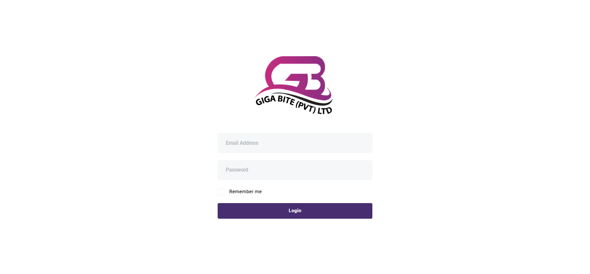
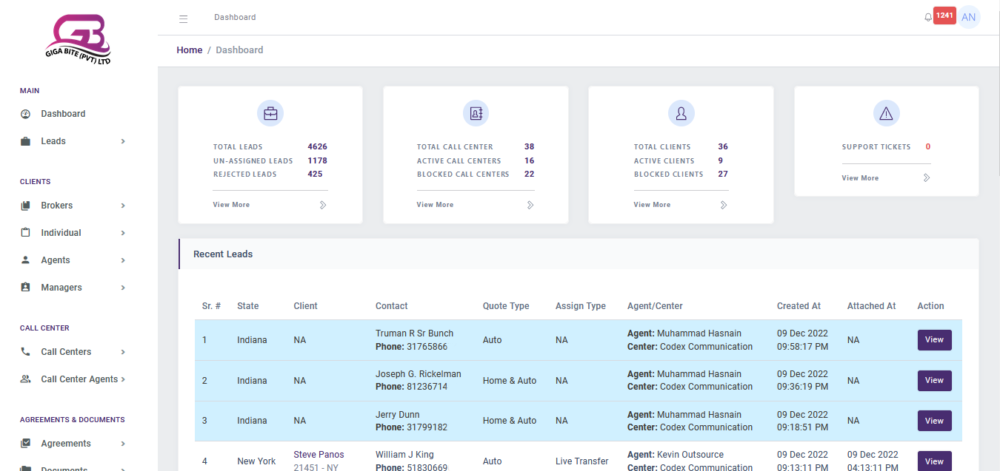
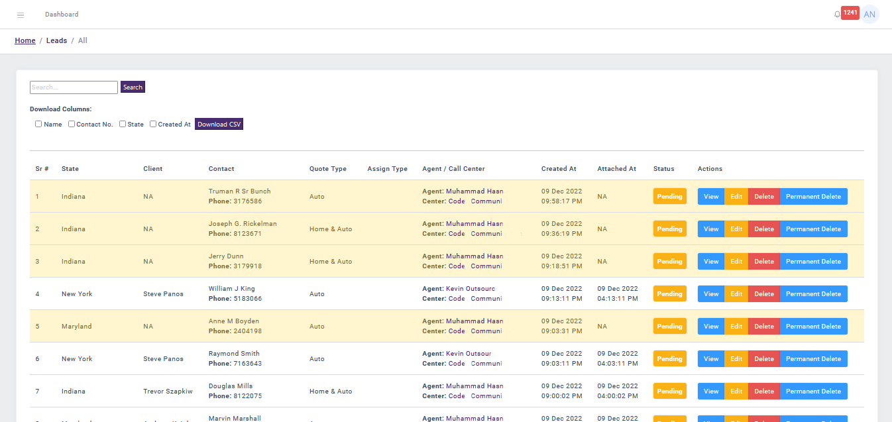
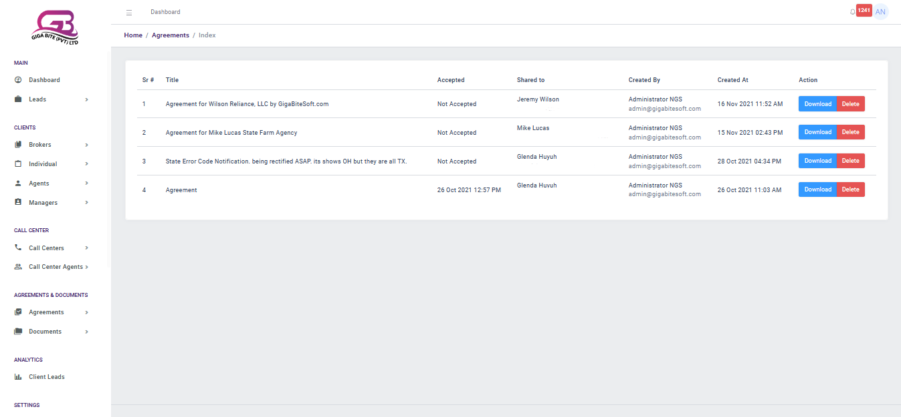
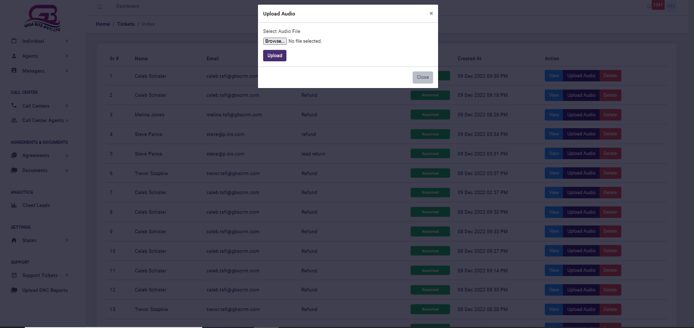
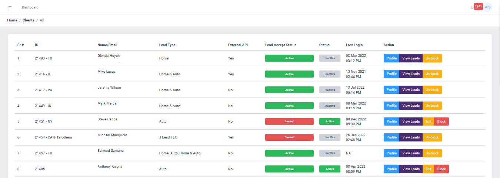
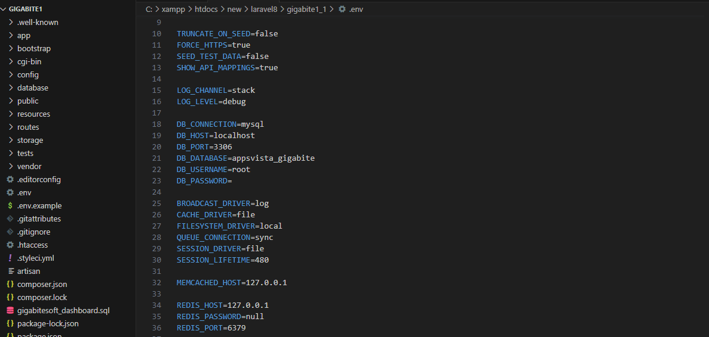
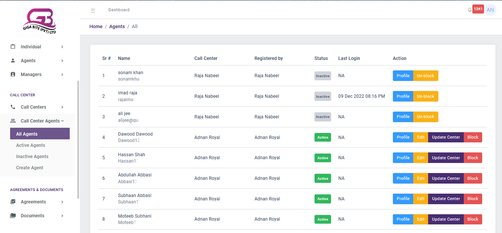

# Multi-Role Laravel Call Center Dashboard

Welcome to the Multi-Role Laravel Call Center Dashboard repository! This project showcases a versatile call center management solution built using Laravel, featuring advanced functionalities and role-based access control.

## Project Overview

The Multi-Role Laravel Call Center Dashboard caters to a diverse range of users, including Admins, Clients, Call Centers, Managers, Brokers, and Individuals. It offers an intuitive and feature-rich dashboard tailored to meet the unique needs of each role.

### Key Features

- **Role-Based Access Control**: Ensure secure access for different user roles with granular permission settings.
- **UI Revamp**: Experience a modern and user-friendly interface designed with Bootstrap, CSS, HTML5, and JavaScript.
- **Advanced Functionalities**: Benefit from advanced features such as audio management and report uploads for enhanced productivity.
- **Bug Fixes**: Enjoy a seamless user experience with resolved bugs and optimizations.

## Screenshots

## Technologies Used

- Laravel
- PHP
- HTML5
- CSS
- JavaScript
- Bootstrap

## Getting Started

To get started with the Multi-Role Laravel Call Center Dashboard locally, follow these steps:

1. Clone the repository:
git clone https://github.com/HamadRizwan007/MultiRole-Laravel-CallCenter-Dashboard.git

2. Navigate to the project directory:
cd MultiRole-Laravel-CallCenter-Dashboard

3. Install dependencies (if applicable):
composer install

4. Run the project:
php artisan serve

## Contributing

Contributions are welcome! If you have ideas, suggestions, or improvements for the Multi-Role Laravel Call Center Dashboard, feel free to open an issue or submit a pull request.
